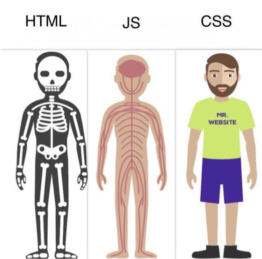

<style>
  :root{
      --color-background-code: #222222;
      --color-foreground: #FFF;
    }
marp-pre,.language-python{
     border-radius: .5em;
      color:#FFF;
}
code{
    border-radius: 7px;
    padding: 1.2em!important;
}
</style>

# HTML

超文本標記語言(HyperText Markup Language)
網站的骨架


---

# 元素

網站所有東西都是由元素組成


---

# 文字

```html
<p>段落
  <b>粗體</b>
  <i>斜體</i>
  <s>刪除線</s>
  <u>底線</u>
  H<sup>+</sup>
CO<sub>2</sub>
</p>
```

---


**粗體**
*斜體*
~~刪除線~~
<u>底線</u>
  H<sup>+</sup> CO<sub>2</sub>

---

# 圖片

格式

```html

```

範例

```html

```


---