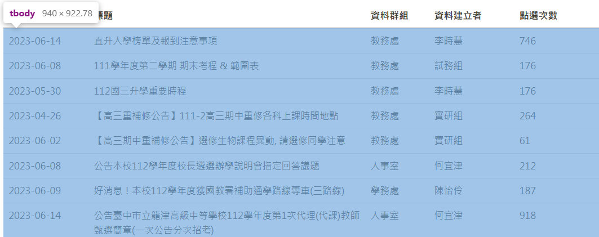
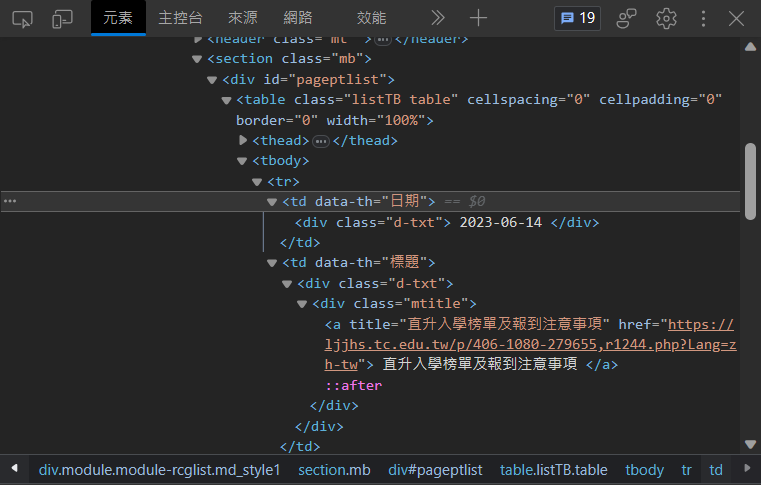
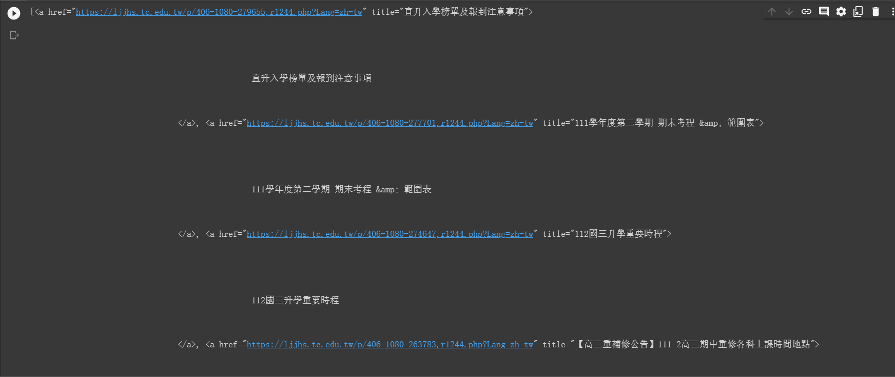

<style>
  :root{
      --color-background-code: #222222;
      --color-foreground: #FFF;
    }
marp-pre,.language-python{
     border-radius: .5em;
      color:#FFF;
}
code{
    border-radius: 7px;
    padding: 1.2em!important;
}
</style>

# **Python網頁爬蟲營隊**

## 西苑高中資訊志工

### 講師：陳邱嵩、賴諺毅

---

<!-- _class: lead -->
# 網路爬蟲和它的應用

---

# 什麼是網路爬蟲
### 當成是蜘蛛網   
- 用於從網際網路上擷取資料
    - 可以爬重要的資訊:校網
    - ~~最大功用是收集梗圖~~
- 可以模擬人類在網頁上的瀏覽行為
- 自動下載網頁並提取其中的資訊  

---

# 網路爬蟲的種類
- 通用網路爬蟲
    - 可以爬取全網際網路中的資料搜尋
    - e.g: Google、Bing等搜尋引擎
- 聚焦網路爬蟲
    - aka主題爬蟲，這種爬蟲只會選擇性爬取資料
    - 使用較少時間、資源
- 增量式網路爬蟲
    - 只爬取新資料，盡量減少空間和時間的消耗
    - 開發較複雜、不太普及

---

<!-- _class: lead -->
# 爬蟲的道德和法律考量
- 遵守網站的使用條款和服務條款
    - 在使用爬蟲之前
      應該仔細閱讀並理解網站的使用條款和服務條款
- 尊重網站所有者的權益
    - 不應該對網站造成過大的負擔或破壞
    - 遵守網站的機器人協議（robots.txt）並尊重網站的限制

---

## robot.txt
- 告知網路爬蟲哪些網頁可以被訪問或爬取
    - 遵守網站的使用規則
    - 減少伺服器負載以及保護網站免受不必要的訪問


---

## 常見的 robots.txt 規則
 1. 允許所有爬蟲訪問整個網站
```
User-agent: *
Disallow:
```
2. 禁止所有爬蟲訪問整個網站
```
User-agent: *
Disallow: /
```

---

# **靜態爬蟲**
- 顧名思義就是只能專門爬靜態網站的爬蟲
  - 靜態網站：預先產生好並且內容不會改變的網站(每次都是回應傳相同的檔案)
- 優點：省資源、簡單
- 缺點：有的東西爬不到
---

<!-- _class: lead -->
# **動態爬蟲**

---

<!-- _class: lead -->
# **Python Requests**
---
# **Requests**
- 讓你可以用簡單的Python去對網站做請(~~騷~~)求(~~擾~~)
- 當然也可以自訂Header、帶參數
  - cookie, User-Agent, etc.
- Request下載
    - ```pip3 install requests```

---

<!-- _class: lead -->
# **BeautifulSoup**

---

# **BeautifulSoup**
- aka美麗湯，用來處理HTML中的資料
- 會需要有**語法分析器**去分析HTML
    - e.g: lxml, html5lib(這邊使用html5lib)
    - 不同語法分析器會有速度、結果的不同，有容錯率之別
- html5lib下載: 
    - ```pip3 install html5lib```
- beautifulsoup下載：
    - ```pip3 install beautifulsoup4```

---

<!-- _class: lead -->
# **靜態爬蟲實作**
---
# **下載模組**
- beautifulsoup下載：
    - ```pip3 install beautifulsoup4```
- html5lib下載: 
    - ```pip3 install html5lib```
- Request下載
    - ```pip3 install requests```
---
# **流程**
1. 利用Python程式進行HTTP請求
2. 利用HTML解析器(美麗湯4)處理資料
3. 分析及利用網頁資源

---

# **這邊以校園公告為例**

---

1. 引入需要用到的模組
2. 進入到[神祕的地方](https://ljjhs.tc.edu.tw/p/403-1080-1244-1.php?Lang=zh-tw)複製他的網址
3. 用名叫url的變數儲存這條網址(字串)
4. 以GET方式向網站請求資料，並儲存
```python
from bs4 import BeautifulSoup #1
import requests #2
url = "網址" #3
response = requests.get(url).text #4
print(response) #看看他的HTML
```

---

5. 把response丟給美麗湯4解析
```python
soup = BeautifulSoup(response, 'html5lib') #5

```

---

### **接下來我們來分析一下公告的HTML**

---


- 不難發現，整個我們想要的資料都在這個tbody標籤中

---


- 而在tbody中有一個一個**tr**標籤
  - 在tr標籤內還有不同標籤，我們會focus在<a>和<div>

---

6. 找到tbody(資料的外框)
7. 從tbody中找出所有的<a>
8. 把它print出來看看

```python
tbody = soup.find('tbody') #6
a_tag_list = tbody.find_all('a') #7
print(a_tag_list) #8
```

---



--- 

- 可以發現他是個由<tr>底下的<a>組成的列表
- 再來用for迴圈去跑這些<a>
  - 取裡面href跟title屬性的值存到list裡

---

```python

for a_tag in a_tag_list:
    links_list.append(a_tag.get('href')) 
    titles_list.append(a_tag.get('title')) 

```

---

- 除了連結跟標題外我們再蒐集日期
  - 從P.22的圖片可以看出，日期是存在特定
    td的div裡的，取出後一樣存在list裡


---

```python

td_tag_list = tbody.find_all('td', attrs={"data-th" : "日期"}) 
for td_tag in td_tag_list:
    div = td_tag.find("div")
    dates_list.append(div.text.strip())

```
- strip()是用來刪去字串中某些特定字元的
  預設是空白

---

fullcode
```python
from bs4 import BeautifulSoup
import requests
url = "https://ljjhs.tc.edu.tw/p/403-1080-1244-1.php?Lang=zh-tw"
titles_list = []
links_list = []
dates_list = []
response = requests.get(url).text#得到HTML
soup = BeautifulSoup(response, 'html5lib')#丟進美麗湯解析
#print(response)
tbody = soup.find('tbody') 
a_tag_list = tbody.find_all('a')
for a_tag in a_tag_list:
    links_list.append(a_tag.get('href')) 
    titles_list.append(a_tag.get('title')) 
td_tag_list = tbody.find_all('td', attrs={"data-th" : "日期"}) 
for td_tag in td_tag_list:
    div = td_tag.find("div")
    dates_list.append(div.text.strip())
```

---