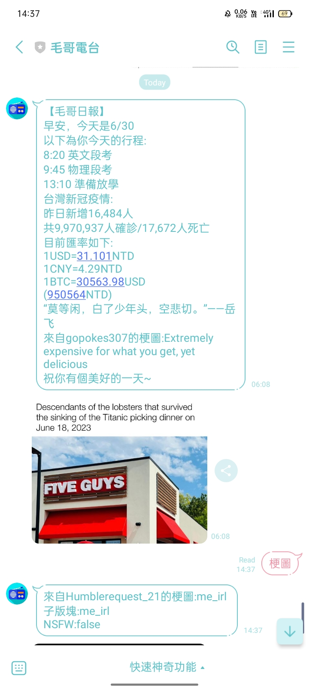
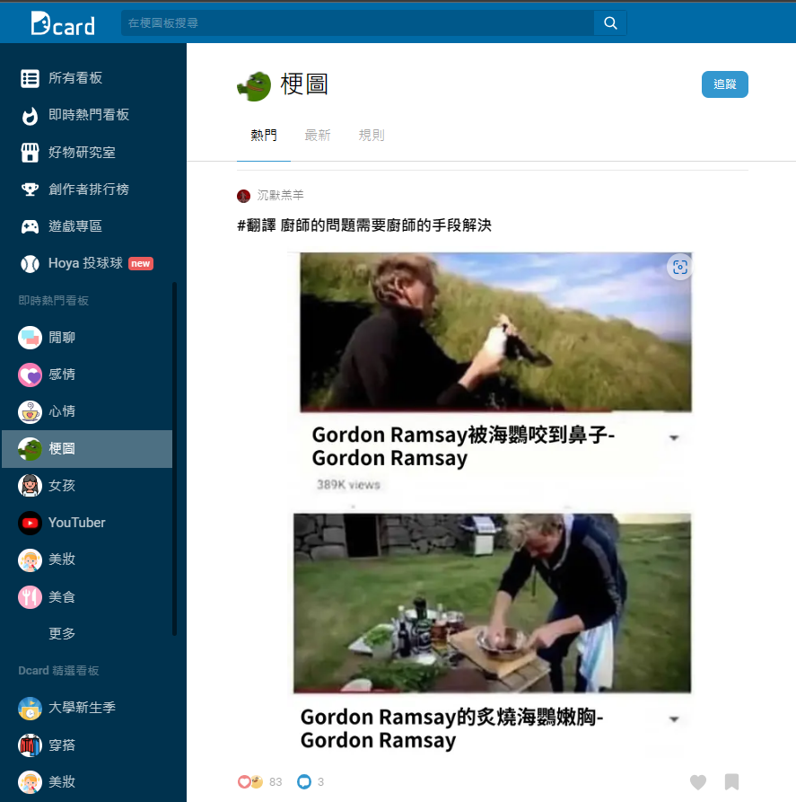
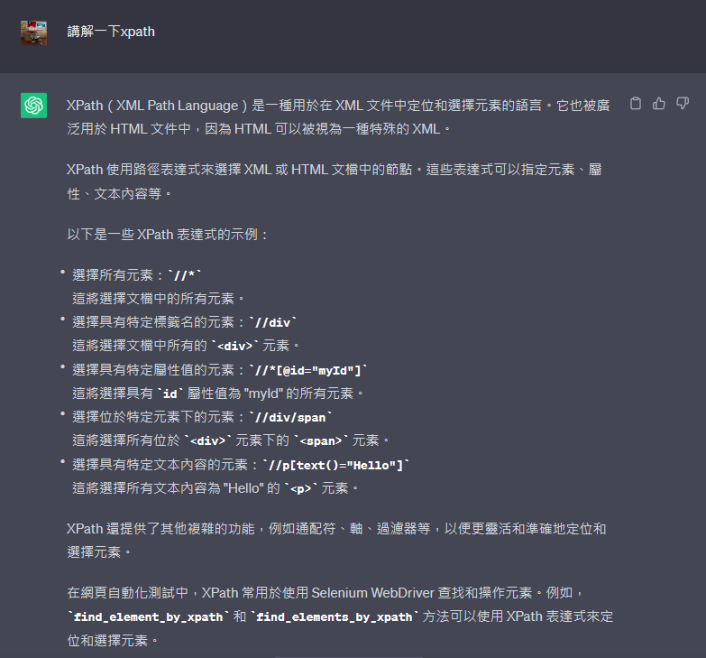
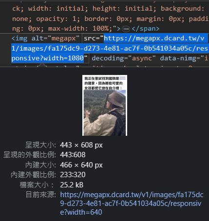
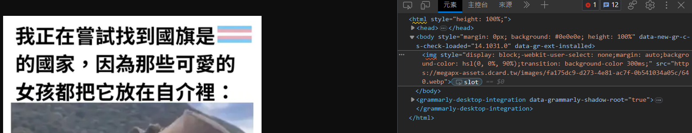

<style>
  :root{
      --color-background-code: #222222;
      --color-foreground: #FFF;
    }
  marp-pre,.language-python{
    border-radius: .5em;
    color:#FFF;
   padding: 1.2em!important;
  } 
  code{
    border-radius: 7px;
  }
</style>

# **PYTHON爬蟲營隊**

## 西苑高中資訊志工

### 講師：陳邱嵩、賴諺毅

---

<!-- _class: lead -->
# 網路爬蟲和它的應用

---

# 什麼是網路爬蟲
### 當成是蜘蛛網   
- 用於從網際網路上擷取資料
    - 可以爬重要的資訊:校網
    - ~~最大功用是收集梗圖~~
- 可以模擬人類在網頁上的瀏覽行為
- 自動下載網頁並提取其中的資訊  


---


---




---

# 網路爬蟲的種類
- 通用網路爬蟲
    - 可以爬取全網際網路中的資料搜尋
    - e.g: Google、Bing等搜尋引擎
- 聚焦網路爬蟲-->這次ㄉ
    - aka主題爬蟲，這種爬蟲只會選擇性爬取資料
    - 使用較少時間、資源
- 增量式網路爬蟲
    - 只爬取新資料，盡量減少空間和時間的消耗
    - 開發較複雜、不太普及

---

<!-- _class: lead -->
# 爬蟲的道德和法律考量
- 遵守網站的使用條款和服務條款
    - 在使用爬蟲之前
      應該仔細閱讀並理解網站的使用條款和服務條款
- 尊重網站所有者的權益
    - 不應該對網站造成過大的負擔或破壞
    - 遵守網站的機器人協議（robots.txt）並尊重網站的限制

---

## robot.txt
- 告知網路爬蟲哪些網頁可以被訪問或爬取
    - 遵守網站的使用規則
    - 減少伺服器負載以及保護網站免受不必要的訪問


---

## 常見的robots.txt規則
 1. 允許所有爬蟲訪問整個網站
```
User-agent: *
Disallow:
```
2. 禁止所有爬蟲訪問整個網站
```
User-agent: *
Disallow: /
```

---

# **靜態爬蟲**
- 顧名思義就是只能專門爬靜態網站的爬蟲
  - 靜態網站：預先產生好並且內容不會改變的網站(每次都是回應傳相同的檔案)
- 優點：省資源、簡單
- 缺點：有的東西爬不到
---

<!-- _class: lead -->
# **動態爬蟲**

---

<!-- _class: lead -->
# **Python Requests**

---
# **Requests**
- 讓你可以用簡單的Python去對網站做請(~~騷~~)求(~~擾~~)
- 當然也可以自訂Header、帶參數
  - cookie, User-Agent, etc.
```python
pip3 install requests
```
---

<!-- _class: lead -->
# **BeautifulSoup**

---

# **BeautifulSoup**
- aka美麗湯，用來處理HTML中的資料
- 會需要有**語法分析器**去分析HTML
    - e.g: lxml, html5lib(這邊使用html5lib)
    - 不同語法分析器會有速度、結果的不同，有容錯率之別
```python
pip3 install beautifulsoup4
```

---

<!-- _class: lead -->
# **靜態爬蟲實作**
---

# **流程**
1. 利用Python程式進行HTTP請求
2. 利用HTML解析器(美麗湯4)處理資料
3. 分析及利用網頁資源

---

# **這邊以校園公告為例**

---

# 下載
```
pip3 install requests
```
```
pip3 install beautifulsoup4
```

---

- 引入需要用到的模組
- 進入到[神祕的地方](https://ljjhs.tc.edu.tw/p/403-1080-1244-1.php?Lang=zh-tw)複製他的網址
- 用名叫url的變數儲存這條網址(字串)
- 以GET方式向網站請求資料，並儲存
```python
from bs4 import BeautifulSoup
import requests
url = "網址"
response = requests.get(url).text
print(response) #看看他的HTML
```

---

- 把response丟給美麗湯4解析
```python
soup = BeautifulSoup(response, 'html5lib') #5

```

---

### **接下來我們來分析一下公告的HTML**

---


- 不難發現，整個我們想要的資料都在這個tbody標籤中

---


- 而在tbody中有一個一個**tr**標籤
  - 在tr標籤內還有不同標籤，我們會focus在`<a>`和`<div>`

---

6. 找到tbody(資料的外框)
7. 從tbody中找出所有的`<a>`
8. 把它print出來看看

```python
tbody = soup.find('tbody') #6
a_tag_list = tbody.find_all('a') #7
print(a_tag_list) #8
```

---


--- 

- 可以發現他是個由`<tr>`底下的`<a>`組成的列表
- 再來用for迴圈去跑這些`<a>`
  - 取裡面href跟title屬性的值存到list裡

---

```python

for a_tag in a_tag_list:
    links_list.append(a_tag.get('href')) 
    titles_list.append(a_tag.get('title')) 

```

---

- 除了連結跟標題外我們再蒐集日期
  - 從P.22的圖片可以看出，日期是存在特定
    td的div裡的，取出後一樣存在list裡


---

```python

td_tag_list = tbody.find_all('td', attrs={"data-th" : "日期"}) 
for td_tag in td_tag_list:
    div = td_tag.find("div")
    dates_list.append(div.text.strip())

```
- strip()是用來刪去字串中某些特定字元的
  預設是空白

---

Full Code

```python
from bs4 import BeautifulSoup
import requests
url = "https://ljjhs.tc.edu.tw/p/403-1080-1244-1.php?Lang=zh-tw"
titles_list = []
links_list = []
dates_list = []
response = requests.get(url).text#得到HTML
soup = BeautifulSoup(response, 'html5lib')#丟進美麗湯解析
#print(response)
tbody = soup.find('tbody') 
a_tag_list = tbody.find_all('a')
for a_tag in a_tag_list:
    links_list.append(a_tag.get('href')) 
    titles_list.append(a_tag.get('title')) 
td_tag_list = tbody.find_all('td', attrs={"data-th" : "日期"}) 
for td_tag in td_tag_list:
    div = td_tag.find("div")
    dates_list.append(div.text.strip())
```

---

# 動態爬蟲實作
## **Selenium**

---

# Selenium
- 一種可以用程式語言(Python、C#、etc.)操作網頁
- 可以模擬使用者操作(點擊、填寫文字、滑動)

---

# 來點有趣的
## **去低(~~能~~)卡爬梗圖**

---



---

先講解一下等等會用到的一些函式
- driver.find_elements(By.id, By.XPATH ......)
  - 等等會用XPATH，因為賊好用
  - ##### **XPATH介紹在下一頁**
- element.get_attribute("attr")
  - 取得Tag中特定屬性的值
- string.startswith("123")
  - 如果字串的開頭是123的話回傳True，反之為False。
- driver.execute_script('JavaScript')
  - 能用Selenium執行JavaScript

---
- time.sleep(1)
  - 直接讓程式**睡**1秒
- list.append('2')
  - 可以直接在list的後面多加入一個東西
  - e.g:
  ```python
    number_list = [0, 1]
    list.append('2')
    >>> [0, 1, 2]
  ```


---



---

- 引入需要的模組
- 去複製[Dcard梗圖板](https://www.dcard.tw/f/meme)的網址
- 先開2個list一個存src內的網址
  - 一個存請求後的圖片位置(這才是我們要的)
- 用driver請求Dcard
- 在請求後等一下讓他載入
  - 用time.sleep(second) #等待second秒


---

```python
from selenium import webdriver
from selenium.webdriver.common.by import By
import time 
import requests

url = "https://www.dcard.tw/f/meme"
driver = webdriver.Chrome() #也可以是Edge(), Firefox(), etc.
page_link_list = [] #空list
img_link_list = [] #空list
driver.get(url)
time.sleep(5) #等待網頁載入可以久一點點沒關係

```

---


- 可以發現圖片是用表示
  - 更方便的是，他的連結就直接在src中，
  所以我們要做的就是請求那個連結後下載回傳的結果！

---

- 因為可以發現，所有圖片有一個alt屬性且名稱都是megapx。
  - 我們可以用By.XPATH快樂的找Tag
- 找到了元素後，取他src的值，存進page_elements_list
- 把頁面往下滑
```python
 page_elements = driver.find_elements(By.XPATH, "//img[@alt='megapx']")
 page_elements_list.append(page_elements.get_attribute("src"))
 driver.execute_script("window.scrollTo(0,document.body.scrollHeight);")
```

---

#### **這個動作要重複好多遍，所以用迴圈做ㄅ**

---

```python
for i in range(0, 5): #可以把後面的值設定大一點，代表一次抓多一點圖片
    page_elements = driver.find_elements(By.XPATH, "//img[@alt='megapx']")
    for page_element in page_elements:
        if page_element.get_attribute("src").startswith("https"):  #確保存的是網址
            page_link_list.append(page_element.get_attribute("src"))
    driver.execute_script("window.scrollTo(0,document.body.scrollHeight);")
    time.sleep(0.5) #每次划完後等待載入
```

---

#### **這邊講解一下為何不能直接載這個圖片：**
因為我們這時候存到的link觀察一下可以發現
它的結尾並不是正常的圖片格式，那我們直接
請求後下載是沒有用的，我們必須請求後找到
圖片真正的位置，請求後下載才會有用。

---



---



---

# 接下來就是下載的部分

---