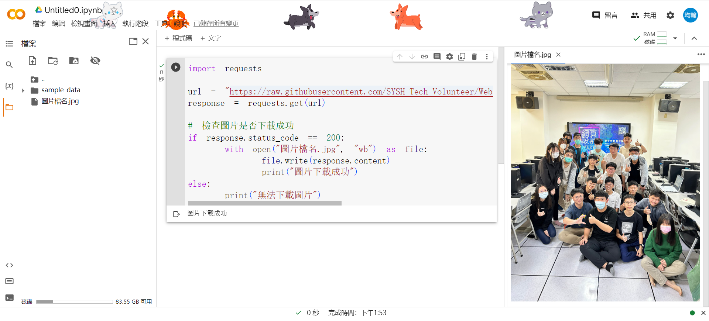

<style>
  :root{
      --color-background-code: #222222;
      --color-foreground: #FFF;
    }
  marp-pre,.language-python{
    border-radius: .5em;
    color:#FFF;
   padding: 1.2em!important;
  } 
  code{
    border-radius: 7px;
  }
</style>


# **成果**


PYTHON爬蟲營隊  
講師:毛宥鈞

---

# 下載圖片

```py
import requests

url = "圖片的連結"  # 替換為要下載的圖片連結
response = requests.get(url)

# 檢查圖片是否下載成功
if response.status_code == 200:
    with open("圖片檔名.jpg", "wb") as file:
        file.write(response.content)
        print("圖片下載成功")
else:
    print("無法下載圖片")
```
---

