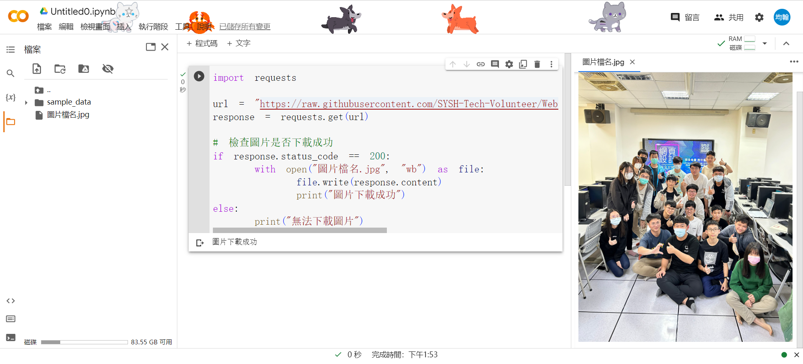

<style>
  :root{
      --color-background-code: #222222;
      --color-foreground: #FFF;
    }
  marp-pre,.language-python{
    border-radius: .5em;
    color:#FFF;
   padding: 1.2em!important;
  } 
  code{
    border-radius: 7px;
  }
</style>


# **PYTHON爬蟲營隊**


西苑高中資訊志工隊 x 龍津高中

---

# 關於我們

西苑高中資訊志工隊是
西苑高中的資訊志工隊


---

# 日程表

- 開場: 9.00~9.30
- 凱歌地牢: 9.30~11.00
- Py基本語法: 11.00~12.00
- 吃飯&午休: 12.00~13.00
- 爬蟲:　13.00~15.00
    - 基本HTML: 13.00~13.20
    - 爬蟲原理: 13.20~13.30
    - 實作: 13.30~15.00

---

# 甚麼是 Python?

Python 是一種直譯式、互動式、物件導向、腳本語言。
Guido van Rossum在1989花三個禮拜做的。

---
<div style="display:flex; align-item: center;"><div style="margin-right:3em">

# 可以幹嘛

* 程式邏輯教學
* 影像處理
* 演算法練習
* 軟體開發
* 大數據分析

</div>
<div text-align=right>


* 網頁應用
* 圖表繪製
* 後端資料庫
* AI 深度學習
* 作業系統應用
* 遊戲引擎
* 韌體開發

</div>
</div>

---

## 加油!&nbsp;&nbsp;&nbsp;&nbsp;&nbsp;&nbsp;&nbsp;&nbsp;&nbsp;


---


CodeCombat 認識Python

---

# 安裝VS Code

---

<!-- _backgroundImage: #000 -->

# 下載並安裝


---

# 安裝python

---

<!-- _backgroundImage: #000 -->

# 下載完後開啟


---

<!-- _backgroundImage: #000 -->

 Add python.exe to PATH
 記得打勾


---

<!-- _backgroundImage: #000 -->

# 安裝vscode插件


---

<!-- _backgroundImage: #000 -->

# Python基礎語法


---

# Python 簡介
* 直譯式程式語言
* 易於學習、閱讀和維護
* 廣泛應用於AI領域
* 網路爬蟲

---

# 變數
* 儲存資料
* 數字不可用於開頭字元。
* 可以使用英文字元、數字或下底線(_)命名。ex : number_id
* 英文大小寫是有差異的。
* 名稱不可使用python語言保留字詞。ex : int
```python
x = "我是變數"
```

---

**輸出**
```python
print("Hello world")
```
**輸入**
```python
x = input("Hello world")
```

---
# 實作時間
### 題目:"輸出"一個叫做"x"的"變數"
### 輸出結果會是"Hello World"  
* 在Hello World前後要加上'' or ""

---
# 解答
```python
x = input("Hello World")
print(x)
```
---


---
# 資料型態
* 數值型態(Numeric type) - int, float, bool
* 字串型態(String type) - str
* 容器型態(Container type) - list, set, dict, tuple
* 用type()查看資料型態
---
# 數值型態
* int 
  * 整數
* float
  * 浮點數(有小數點)
* bool
  * ture
  * faulse
---
# 字串型態
* str(string)
  * 字串
  * 用''或""包住
  * 可用+連接
  * len()查看長度
---
# 容器型態之一:list
* 放多個資料的地方
*  由中括號組成並以逗號隔開不同資料(型態可不同)
*  索引值從0開始

---
# 運算子
* 算術運算子
  * `+`加
  * `-`減
  * `*`乘
  * `/`除
  * `%`取餘數
---
## 關係運算子
<	小於
\>	大於	
<=	小於等於	
\>=	大於等於
==	相等	
!=	不相等	

---
## 邏輯運算子
* `「and:且」`
全都正確才正確  
* `「or:或」` 
一個正確才正確
* `「not:非」`
對-->錯;錯-->對


---
## if
判斷條件 
* 對-->執行if中的程式  
* 錯-->跳出if往下執行，執行else


---

<!-- _backgroundImage: #000 -->

## else-if

* 用於多的條件時
* if執行時會跳過elif和else
* if是錯的-->判斷else-if，都錯-->執行else


---

```python
x = True
y = False
if y:               # False
  print("No way")
elif x and y:       # True and False
  print("come on!")
elif not x:         # not True
  print("please")
else                # do this
  print("嗨壓")
```

---
# 迴圈
重複執行類似的事


---
# for 
可以透過Python迴圈來讀取串列中的每一個元素
較適用於「已知迴圈數」的問題
格式：
```python
for x in range(1, 10, 2):
   # 放要執行的東西
```
range(起始值,結束值,間距值)

---
# while
較適用於「無法預知迴圈數」的問題
格式：
```python
while 條件:   # 條件成立
    # 放要執行的東西
```
---
# break
強制跳出整個迴圈
```python
for i in range(1,5):
  if(i == 3):
    break
print(i) # 所以結果會列出3
```
---
## continue
強制跳出這過迴圈
```python
for i in range(1,5):
  if(i == 3):
    continue
print(i) # 會列出5
```

---

# HTML

---

# HTML

超文本標記語言(HyperText Markup Language)
網站的骨架


---

# 元素

網站所有東西都是由元素組成


---

# 文字

```html
  <p>段落
    <b>粗體</b>
    <i>斜體</i>
    <s>刪除線</s>
    <u>底線</u>
    H<sup>+</sup>
  CO<sub>2</sub>
  </p>
```

---


**粗體**
*斜體*
~~刪除線~~
<u>底線</u>
  H<sup>+</sup> CO<sub>2</sub>

---

# 圖片

格式

```html

```

範例

```html

```


---
# **網頁原理**

講師：蕭翊均、林欣儒

---


---

1. 瀏覽器去 DNS (電話簿)查 IP 地址
2. 瀏覽器向伺服器傳送 HTTP 請求網站資料
   * 交通規則 - HTTPS、FTP
   * 交通工具 - GET
3. 伺服器回傳回應
   * 狀態(如200 OK, 404 Not Found)
      * [各種 HTTP 狀態碼介紹](https://http.cat/)
   * 檔案(如HTML, CSS, JS, JPG, PNG)
4. 瀏覽器把一小塊一小塊的東西(封包)，組合成完整的網站，並把它呈現起來

<!-- 訪問網站猶如寄送包裹
     包裹就是檔案
     透過哪條路：網路
     地址=ip位置，ip太醜改成有意義的名字=>Domain
     交通規則：tcp底下的http(網頁常用)


     
     交通工具：GET、POST   
 -->
---

<!-- _class: lead -->
# IP Adress & DNS

---

1. **IP Address**
 當連上網路後，每台電腦在網路中的位置
   * IPv4、IPv6
   * Google: 172.217.160.110 / 2404:6800:4012:1::200e
1. **DNS(Domain Name System)**
  一個可以把IP跟域名(Domain)轉換的系統
   * 172.217.160.110 www.google.com 
   * 可以申請自己的網域

---
# 網路爬蟲和它的應用

講師：陳邱嵩、賴諺毅

---

# 什麼是網路爬蟲
### 當成是蜘蛛網   
- 用於從網際網路上擷取資料
    - 可以爬重要的資訊:校網
    - ~~最大功用是收集梗圖~~
- 可以模擬人類在網頁上的瀏覽行為
- 自動下載網頁並提取其中的資訊  

---


---

# 網路爬蟲的種類
- 通用網路爬蟲
    - 可以爬取全網際網路中的資料搜尋
    - e.g: Google、Bing等搜尋引擎
- 聚焦網路爬蟲-->這次ㄉ
    - aka主題爬蟲，這種爬蟲只會選擇性爬取資料
    - 使用較少時間、資源
- 增量式網路爬蟲
    - 只爬取新資料，盡量減少空間和時間的消耗
    - 開發較複雜、不太普及

---

<!-- _class: lead -->
# 爬蟲的道德和法律考量
- 遵守網站的使用條款和服務條款
    - 在使用爬蟲之前
      應該仔細閱讀並理解網站的使用條款和服務條款
- 尊重網站所有者的權益
    - 不應該對網站造成過大的負擔或破壞
    - 遵守網站的機器人協議（robots.txt）並尊重網站的限制

---

## robot.txt

<!-- _backgroundImage: #000 -->

- 告知網路爬蟲哪些網頁可以被訪問或爬取
    - 遵守網站的使用規則
    - 減少伺服器負載以及保護網站免受不必要的訪問


---

## 常見的robots.txt規則
 1. 允許所有爬蟲訪問整個網站
```
User-agent: *
Disallow:
```
2. 禁止所有爬蟲訪問整個網站
```
User-agent: *
Disallow: /
```

---

# **靜態爬蟲**
- 顧名思義就是只能專門爬靜態網站的爬蟲
  - 靜態網站：預先產生好並且內容不會改變的網站(每次都是回應傳相同的檔案)
- 優點：省資源、簡單
- 缺點：有的東西爬不到
---

<!-- _class: lead -->
# **動態爬蟲**

---

<!-- _class: lead -->
# **Python Requests**

---
# **Requests**
- 讓你可以用簡單的Python去對網站做請(~~騷~~)求(~~擾~~)
- 當然也可以自訂Header、帶參數
  - cookie, User-Agent, etc.
```python
pip3 install requests
```
---

<!-- _class: lead -->
# **BeautifulSoup**

---

# **BeautifulSoup**
- aka美麗湯，用來處理HTML中的資料
- 會需要有**語法分析器**去分析HTML
    - e.g: lxml, html5lib(這邊使用html5lib)
    - 不同語法分析器會有速度、結果的不同，有容錯率之別
```python
pip3 install beautifulsoup4
```

---

<!-- _class: lead -->
# **靜態爬蟲實作**
---

# **流程**
1. 利用Python程式進行HTTP請求
2. 利用HTML解析器(美麗湯4)處理資料
3. 分析及利用網頁資源

---

# **這邊以校園公告為例**

---

# 下載
```
pip3 install requests
```
```
pip3 install beautifulsoup4
```

---

- 引入需要用到的模組
- 進入到[神祕的地方](https://ljjhs.tc.edu.tw/p/403-1080-1244-1.php?Lang=zh-tw)複製他的網址
- 用名叫url的變數儲存這條網址(字串)
- 以GET方式向網站請求資料，並儲存
```python
from bs4 import BeautifulSoup
import requests
url = "網址"
response = requests.get(url).text
print(response) #看看他的HTML
```

---

- 把response丟給美麗湯4解析
```python
soup = BeautifulSoup(response, 'html5lib') #5

```

---

### **接下來我們來分析一下公告的HTML**

---


- 不難發現，整個我們想要的資料都在這個tbody標籤中

---


- 而在tbody中有一個一個**tr**標籤
  - 在tr標籤內還有不同標籤，我們會focus在`<a>`和`<div>`

---

6. 找到tbody(資料的外框)
7. 從tbody中找出所有的`<a>`
8. 把它print出來看看

```python
tbody = soup.find('tbody') #6
a_tag_list = tbody.find_all('a') #7
print(a_tag_list) #8
```

---


--- 

- 可以發現他是個由`<tr>`底下的`<a>`組成的列表
- 再來用for迴圈去跑這些`<a>`
  - 取裡面href跟title屬性的值存到list裡

---

```python

for a_tag in a_tag_list:
    links_list.append(a_tag.get('href')) 
    titles_list.append(a_tag.get('title')) 

```

---

- 除了連結跟標題外我們再蒐集日期
  - 從P.22的圖片可以看出，日期是存在特定
    td的div裡的，取出後一樣存在list裡


---

```python

td_tag_list = tbody.find_all('td', attrs={"data-th" : "日期"}) 
for td_tag in td_tag_list:
    div = td_tag.find("div")
    dates_list.append(div.text.strip())

```
- strip()是用來刪去字串中某些特定字元的
  預設是空白

---

Full Code

<!-- _backgroundImage: #000 -->

```python
from bs4 import BeautifulSoup
import requests
url = "https://ljjhs.tc.edu.tw/p/403-1080-1244-1.php?Lang=zh-tw"
titles_list = []
links_list = []
dates_list = []
response = requests.get(url).text#得到HTML
soup = BeautifulSoup(response, 'html5lib')#丟進美麗湯解析
#print(response)
tbody = soup.find('tbody')
a_tag_list = tbody.find_all('a')
for a_tag in a_tag_list:
    links_list.append(a_tag.get('href')) 
    titles_list.append(a_tag.get('title')) 
td_tag_list = tbody.find_all('td', attrs={"data-th" : "日期"}) 
for td_tag in td_tag_list:
    div = td_tag.find("div")
    dates_list.append(div.text.strip())
```

---

# 動態爬蟲實作
## **Selenium**

---

# Selenium
- 一種可以用程式語言(Python、C#、etc.)操作網頁
- 可以模擬使用者操作(點擊、填寫文字、滑動)

---

# 來點有趣的
## **去低(~~能~~)卡爬梗圖**

---


---

先講解一下等等會用到的一些函式
- driver.find_elements(By.id, By.XPATH ......)
  - 等等會用XPATH，因為賊好用
  - ##### **XPATH介紹在下一頁**
- element.get_attribute("attr")
  - 取得Tag中特定屬性的值
- string.startswith("123")
  - 如果字串的開頭是123的話回傳True，反之為False。
- driver.execute_script('JavaScript')
  - 能用Selenium執行JavaScript

---
- time.sleep(1)
  - 直接讓程式**睡**1秒
- list.append('2')
  - 可以直接在list的後面多加入一個東西
  - e.g:
  ```python
    number_list = [0, 1]
    list.append('2')
    >>> [0, 1, 2]
  ```


---


---

- 引入需要的模組
- 去複製[Dcard梗圖板](https://www.dcard.tw/f/meme)的網址
- 先開2個list一個存src內的網址
  - 一個存請求後的圖片位置(這才是我們要的)
- 用driver請求Dcard
- 在請求後等一下讓他載入
  - 用time.sleep(second) #等待second秒


---

```python
from selenium import webdriver
from selenium.webdriver.common.by import By
import time 
import requests

url = "https://www.dcard.tw/f/meme"
driver = webdriver.Chrome() #也可以是Edge(), Firefox(), etc.
page_link_list = [] #空list
img_link_list = [] #空list
driver.get(url)
time.sleep(5) #等待網頁載入可以久一點點沒關係

```

---

<!-- _backgroundImage: #000 -->


- 可以發現圖片是用``表示
  - 更方便的是，他的連結就直接在src中，
  所以我們要做的就是請求那個連結後下載回傳的結果！

---

- 因為可以發現，所有圖片有一個alt屬性且名稱都是megapx。
  - 我們可以用By.XPATH快樂的找Tag
- 找到了元素後，取他src的值，存進page_elements_list
- 把頁面往下滑
```python
 page_elements = driver.find_elements(By.XPATH, "//img[@alt='megapx']")
 page_elements_list.append(page_elements.get_attribute("src"))
 driver.execute_script("window.scrollTo(0,document.body.scrollHeight);")
```

---

#### **這個動作要重複好多遍，所以用迴圈做ㄅ**

---

```python
for i in range(0, 5): #可以把後面的值設定大一點，代表一次抓多一點圖片
    page_elements = driver.find_elements(By.XPATH, "//img[@alt='megapx']")
    for page_element in page_elements:
        if page_element.get_attribute("src").startswith("https"):  #確保存的是網址
            page_link_list.append(page_element.get_attribute("src"))
    driver.execute_script("window.scrollTo(0,document.body.scrollHeight);")
    time.sleep(0.5) #每次划完後等待載入
```

---

#### **這邊講解一下為何不能直接載這個圖片：**
因為我們這時候存到的link觀察一下可以發現
它的結尾並不是正常的圖片格式，那我們直接
請求後下載是沒有用的，我們必須請求後找到
圖片真正的位置，請求後下載才會有用。

---


---

<!-- _backgroundImage: #000 -->


---

### 接下來就是下載的部分

---

# **成果**


PYTHON爬蟲營隊  
講師:毛宥鈞

---

# 下載圖片

```py
import requests

url = "圖片的連結"  # 替換為要下載的圖片連結
response = requests.get(url)

# 檢查圖片是否下載成功
if response.status_code == 200:
    with open("圖片檔名.jpg", "wb") as file:
        file.write(response.content)
        print("圖片下載成功")
else:
    print("無法下載圖片")
```
---

# 打開圖片

```py
import requests
from PIL import Image

url = "圖片的連結"  # 替換為要下載的圖片連結
response = requests.get(url)

# 檢查圖片是否下載成功
if response.status_code == 200:
    with open("圖片檔名.jpg", "wb") as file:
        file.write(response.content)
        print("圖片下載成功")

    # 打開圖片
    img = Image.open("圖片檔名.jpg")
    img.show()
else:
    print("無法下載圖片")

```

# 迴圈

<!-- _backgroundImage: #000 -->

一次下載多張圖片

```py
import requests

def download_images(image_links):
    for index, link in enumerate(image_links):
        try:
            response = requests.get(link)
            response.raise_for_status()
            with open(f"image_{index+1}.jpg", "wb") as file:
                file.write(response.content)
            print(f"Image {index+1} downloaded successfully.")
        except requests.exceptions.RequestException as e:
            print(f"Error downloading image {index+1}: {e}")

# Example usage
image_links = [
    "https://picsum.photos/200/300",
    "https://picsum.photos/200/300","https://picsum.photos/200/300","https://picsum.photos/200/300","https://picsum.photos/200/300",
]

download_images(image_links)
```
---



---


# 使用pyinstaller包裝成exe


---

安裝pyinstaller

```bat
pip3 install pyinstaller
```

打包成exe
```bat
pyinstaller -F code.py
pyinstaller -F code.py -i "a.ico"
```
* `-F` 打包成單一檔案  
* `-i` 設定圖示

---

### 謝謝大家
感謝大家的參與